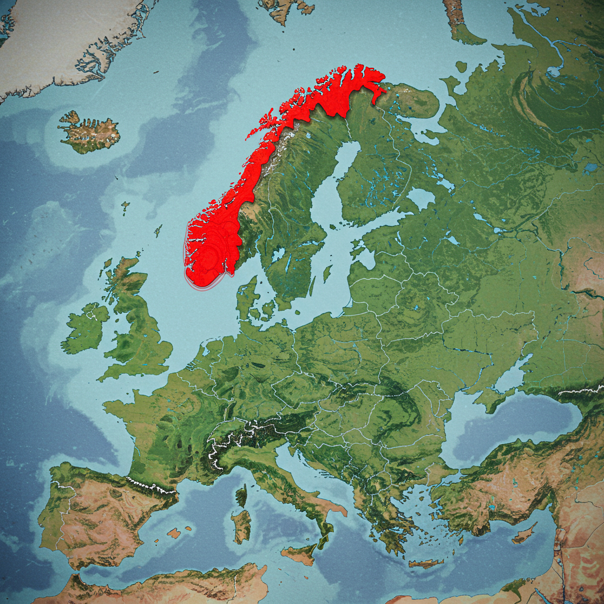

# Multimodale LLM's

## Uitleg: Multimodale LLM's
Slimme computers (LLM's) worden steeds slimmer! Ze kunnen niet alleen goed met taal overweg, maar beginnen ook naar beelden te kijken en te begrijpen. Dat noemen we Multimodale LLM's. Ze combineren taal en beeld, waardoor ze nog veel meer kunnen dan voorheen.

### Hoe werkt het?
In plaats van alleen tekst te geven, kun je een Multimodale LLM ook een afbeelding laten zien. De LLM kan dan de afbeelding analyseren en er iets over vertellen, of er zelfs op reageren. Je kunt het zien als een slimme computer die niet alleen leest, maar ook kijkt! Daarnaast is het mogelijk om de computer zelf plaatjes te tekenen!

### Waarom is het handig?
* Nieuwe mogelijkheden: Multimodale LLM's kunnen veel meer dan alleen tekst verwerken. Ze kunnen bijvoorbeeld afbeeldingen herkennen, beschrijven, en er zelfs op reageren.
* Beter begrip: Door naar beelden te kijken, krijgen LLM's een beter begrip van de wereld om ons heen. Dit helpt ze om taken beter uit te voeren.
* Handige toepassingen: Multimodale LLM's kunnen gebruikt worden voor allerlei handige toepassingen, zoals het herkennen van objecten op een foto, het genereren van bijschriften bij afbeeldingen, en nog veel meer.

# Nu jij:
Kopieer de volgende prompt in https://gemini.google.com

    Genereer een photo van een unicorn die een ijsje eet. Het ijsje heeft de volgende smaken: aardbij, vanille, banaan.

Kopieer de volgende prompt in https://gemini.google.com

    Genereer een plaatje van een unicorn die een ijsje eet. Het ijsje heeft 3 bolletjes: aardbij, vanille, banaan. In South Park stijl.

Download dit plaatje (rechter muis, Opslaan als), en upload het in https://gemini.google.com (met het foto icoontje), kopieer daarna de volgende prompt:

    Welk land op deze kaart is zichtbaar in het rood?